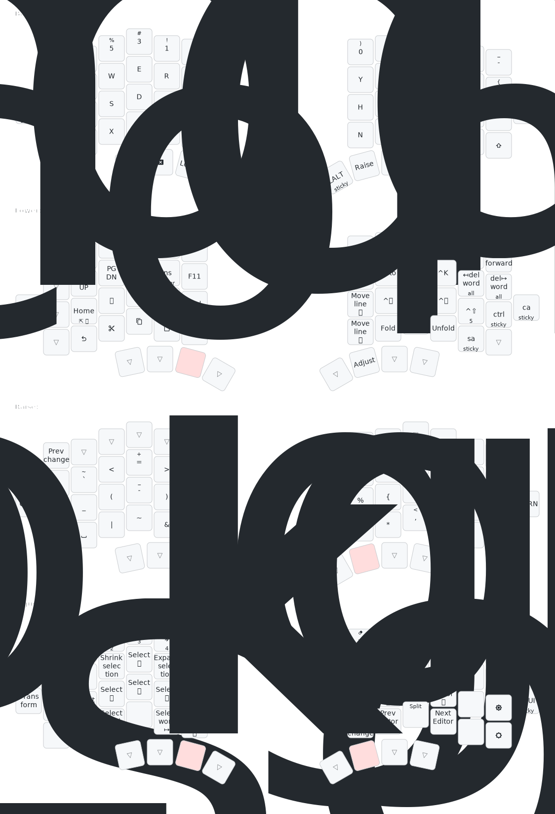

# zmk-config

My split keyboard is Mriya58. The layout is optimized for vscode.

## Keymap

generated using [Keymap-drawer](https://github.com/caksoylar/keymap-drawer) and [Tabler icons](https://tabler-icons.io/)

